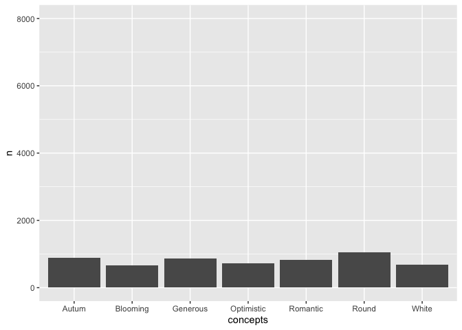

Scent Data Analysis
================
Jack Rechsteiner
2025-06-19

- [Looking for outliers and such](#looking-for-outliers-and-such)
  - [Total concept counts](#total-concept-counts)
    - [Analyses using total concept
      counts](#analyses-using-total-concept-counts)
  - [Concepts by price and gender](#concepts-by-price-and-gender)
  - [Getting concept scores for each
    fragrance](#getting-concept-scores-for-each-fragrance)
- [Identifying brands with lots of price
  variation](#identifying-brands-with-lots-of-price-variation)
- [Getting counts of olfactive family, olfactive subfamily, and
  fragrance
  classifier](#getting-counts-of-olfactive-family-olfactive-subfamily-and-fragrance-classifier)
- [Session Info](#session-info)

``` r
##Set knitr options (show both code and output, show output w/o leading #)
knitr::opts_chunk$set(echo = TRUE, include = TRUE, comment=NA, fig.path = "Images/")

#load tidyverse
library("tidyverse")
```

    ## Warning: package 'ggplot2' was built under R version 4.3.3

    ## Warning: package 'tibble' was built under R version 4.3.3

    ## Warning: package 'purrr' was built under R version 4.3.3

    ## Warning: package 'lubridate' was built under R version 4.3.3

    ## ── Attaching core tidyverse packages ──────────────────────── tidyverse 2.0.0 ──
    ## ✔ dplyr     1.1.4     ✔ readr     2.1.5
    ## ✔ forcats   1.0.0     ✔ stringr   1.5.1
    ## ✔ ggplot2   3.5.2     ✔ tibble    3.3.0
    ## ✔ lubridate 1.9.4     ✔ tidyr     1.3.1
    ## ✔ purrr     1.1.0     
    ## ── Conflicts ────────────────────────────────────────── tidyverse_conflicts() ──
    ## ✖ dplyr::filter() masks stats::filter()
    ## ✖ dplyr::lag()    masks stats::lag()
    ## ℹ Use the conflicted package (<http://conflicted.r-lib.org/>) to force all conflicts to become errors

``` r
#loading country package for easy filtering
library(r2country)
```

    ## Warning: package 'r2country' was built under R version 4.3.3

# Looking for outliers and such

``` r
#reading in RDS
fragrance_df <- 
  readRDS('/Users/jack/Workshop/Scent Project/RDS_files/cleaned_fragrance_df.RDS') %>% 
  #removing the rowwise grouping
  ungroup() %>% 
  #dropping duplicated rows
  distinct()

cleaned_fragrance_df <-
  fragrance_df %>% 
  #removing fragrances with a year before 1980 (1.2% of total dataset)
  filter(year > 1980) %>% 
  #keeping the url as unique id but moving it to the end so I don't have to keep looking at it
  relocate(fragrance_url, .after = last_col()) 

dupes_removed <-
  cleaned_fragrance_df %>%
  #finding all the EAU DE whatevers
  filter(str_detect(fragrance_name, "EAU DE (EXTRAIT|PARFUM|TOILETTE)")) %>% 
  #sorting alphabetically for my own sanity
  arrange(fragrance_name) %>% 
  #separating the columns into name and fragrance type
  separate_wider_regex(fragrance_name, c(fragname =".+", fragtype = "EAU .+"), cols_remove = FALSE) %>% 
  #grouping by fragrance name
  group_by(fragname) %>% 
  #keeping only a singular fragrance
  distinct(fragname, .keep_all = TRUE) %>% 
  #removing grouping
  ungroup() %>% 
  #dropping the separated columns to bind dfs back together
  select(!fragname:fragtype)

#this feels like a really dumb way to do this but I'm feeling dumb today
#making a df with the opposite filter
recleaned_fragrance_df <-
  cleaned_fragrance_df %>%
  #finding everything but the EAU DE fragrances
  filter(!str_detect(fragrance_name, "EAU DE (EXTRAIT|PARFUM|TOILETTE)")) %>% 
  #adding the other df back in
  rbind(dupes_removed) %>% 
  #also going to drop LA PETITE ROBE NOIRE EDT SO FRENCHY 2020 while I'm at it because it's a dupe of LA PETITE ROBE NOIRE EDP SO FRENCHY 2020
  filter(!str_detect(fragrance_name, "LA PETITE ROBE NOIRE EDT SO FRENCHY 2020"))
```

## Total concept counts

``` r
#storing concept words as lists to make the later code cleaner
named_locations <- "Comores|Sweede|African|British|Cambodge|Phillipines|Asian|(Central|South|North) America(n)?|European|Somalie|Australie|England|West Indies|Calabria|Mediterranean|Sicily"

source_based <- "Iodine|Mildew|Roots|Latex|Plastic|Sweaty|Algae|Nutty|Pencil|Milky|Sea|Fur|Organza|Almond|Ink|Animal|Soapy|Medicinal|Powdery|Cotton|Detergent|Salt|Laundry|Air-Freshner|Silk|Caramelized|Creamy|Garden|Grassy|Metal(l)?ic|Ocean|Honeyed|Smoky|Sugary|Candy|Salty|Spicy|Leather|Fruity|Orange|Herbal|Musky|Leaf|Rain|Shrub|Earth|Mossy|Zesty|Forest|Citrus|Ambery|Ozone|Camphoric|Lavender|Earthy|Floral|Woody|Gloves"

abstract_cross_modal <- "Culture|Fantasy|Nature|Cold|Soft|Tropical|Humid|Dry|Beach|Culinary|Mountain|Bitter|Breeze|Outdoor|Countryside|Yummy|Fields|Funfair|Chrismacy|Glitters|Desert|Mouth-Watering|Appetizing|Delicious|Bright|Darkness|Chrismas|Tender|Textured|Airy|Supple|Heady|Velvety|Luminous|Aquatic|Natural|Pure|Smooth|Holidays|Dark|Heat|Sweet|Hot|Marine|Light|Sunny|Deep|Warm|Colourful|Fresh|Radiant|Loud|Clean|Sparkling|Summer|Blooming|Spring|Night|Round|Winter|Autum|Day|City|Childhood|Cristals"

evaluative_persona <- "Artistic|Classic|Banal|Professional|Quircky|Witty|Aristocratic|Eccentric|Formal|Childish|Old-Fashioned|Oldie|Opulent|Avant Garde|Sickening|Iconic|Graceful|Flamboyant|Luscious|Masculine|Noble|Clean Cut|Modern|Minimalistic|Daring|Bold|Luxury|Suave|Fashion|Authentic|Innocent|Classy|Primitive|Mystical|Original|Oriental|Girly|Sophisticated|Unisexe|Affirmed|Self-Confident|Carnal|Feminine|Dynamic|Sporty|Exotic|Elegant|Romantic|Generous|Casual|Everyday|Heritage|Greedy|Craftmanship"

effect_emotion <- "Serene|Tranquility|Relaxing|Reassuring|Melancholy|Nostalgia|(E|I)nvigorating|Stimulating|Exciting|Energetic|Comfortable|Joyful|Energyzing|Happy|Cheerful|Freedom|Optimistic"

intensity <- "Imperceptible|Feathers|Aggressive|Discrete|Pervasive|Transparent|Wrapping|Enveloping|Watery|Strong|Vaporous|Noticeable|Heavy|Powerful|Robust|Intense|Rich"

composition_fragrance_jargon <- "Aldehydic|Astringent|Resinous|Mineral|Chemical|Fixative|Acid|Pungent|Gourmand|Vertical|Aromatic"

#look into "colors" as a whole category but also look at how the colors individually pattern in relation to price

colors <- "Blue|Silver|Red|Yellow|Pink|Green|Gold|Grey|Purple|Black|Brown|White"

#be wary, the resulting df is big
split_concepts_df <-
  recleaned_fragrance_df %>% 
  #dropping some columns to make the df a little less gigantic
  select(fragrance_name:brand_name, price, origin:concepts) |> 
  #turning the comma strings of concepts into a one concept per row
  separate_longer_delim(cols = "concepts", delim = ", ") %>% 
  #somehow that introduced a singular blank row, so I'll filter that out
  ##also "rehash" only occurs once and its like a meta-descriptor, so we'll drop that too
  filter(concepts != c("", "Rehash")) %>% 
  #converting all strings to sentence case
  mutate(across(concepts, ~ str_to_title(.x))) %>% 
  #using case_when and str_detect to sort the concepts into different categories...
  ##using the saved strings from above
  mutate(concept_bin = case_when(
    #using str_flatten and the country_names data from r2country to save some time
    str_detect(concepts, str_flatten(country_names$name, collapse = "|")) ~ "named location",
    str_detect(concepts, named_locations) ~ "named location",
    str_detect(concepts, source_based) ~ "source-based",
    str_detect(concepts, abstract_cross_modal) ~ "abstract/cross-modal",
    str_detect(concepts, evaluative_persona) ~ "evaluative/persona",
    str_detect(concepts, effect_emotion) ~ "effect/emotion",
    str_detect(concepts, intensity) ~ "intensity",
    str_detect(concepts, composition_fragrance_jargon) ~ "composition/fragrance jargon",
    str_detect(concepts, colors) ~ "color",
    .default = "unassigned"))
```

### Analyses using total concept counts

``` r
#seeing if infrequent concept words occur more often with expensive perfumes
split_concepts_df |> 
  #get counts for concepts
  add_count(concepts, name = "concept_count") |> 
  #getting total of each price point before mutating df further
  add_count(price, name = "price_total_tokens") |> 
  #filtering to only concepts that appear 10 or less times
  filter(concept_count <= 10) |> 
  #getting count for number of times that each price occurs
  add_count(price, name = "price_count") |> 
  #dividing the infrequent concept count each price's total tokens to account for size differences
  mutate(percent_of_total = (price_count/price_total_tokens)*100) |> 
  #this is probably such a bad way to do this but I wanna wrap this up and go to bed
  group_by(price) |> 
  slice(1) |> 
  select(price, price_total_tokens:percent_of_total)
```

    # A tibble: 3 × 4
    # Groups:   price [3]
      price   price_total_tokens price_count percent_of_total
      <chr>                <int>       <int>            <dbl>
    1 $                    84249         176            0.209
    2 $, $                 51151          61            0.119
    3 $, $, $              95090         339            0.357

``` r
#comparing concept bins across prices
split_concepts_df |> 
  #group by price
  group_by(price) |> 
  #get counts for concept bins
  count(concept_bin) |> 
  #calculate counts as within-group percentages
  mutate(percent  = (n / sum(n) * 100),
         #get within-group totals while I'm at it
         total = sum(n)) |> 
  #split df by price for easier comparison
  (\(.)split(., f = .$price))()
```

    $`$`
    # A tibble: 8 × 5
    # Groups:   price [1]
      price concept_bin                      n percent total
      <chr> <chr>                        <int>   <dbl> <int>
    1 $     abstract/cross-modal         23296  27.7   84249
    2 $     color                         3137   3.72  84249
    3 $     composition/fragrance jargon   564   0.669 84249
    4 $     effect/emotion                8664  10.3   84249
    5 $     evaluative/persona           25399  30.1   84249
    6 $     intensity                    19289  22.9   84249
    7 $     named location                  87   0.103 84249
    8 $     source-based                  3813   4.53  84249

    $`$, $`
    # A tibble: 8 × 5
    # Groups:   price [1]
      price concept_bin                      n percent total
      <chr> <chr>                        <int>   <dbl> <int>
    1 $, $  abstract/cross-modal         14128 27.6    51151
    2 $, $  color                         2170  4.24   51151
    3 $, $  composition/fragrance jargon   288  0.563  51151
    4 $, $  effect/emotion                4527  8.85   51151
    5 $, $  evaluative/persona           15170 29.7    51151
    6 $, $  intensity                    12469 24.4    51151
    7 $, $  named location                  32  0.0626 51151
    8 $, $  source-based                  2367  4.63   51151

    $`$, $, $`
    # A tibble: 8 × 5
    # Groups:   price [1]
      price   concept_bin                      n percent total
      <chr>   <chr>                        <int>   <dbl> <int>
    1 $, $, $ abstract/cross-modal         25860  27.2   95090
    2 $, $, $ color                         4763   5.01  95090
    3 $, $, $ composition/fragrance jargon   553   0.582 95090
    4 $, $, $ effect/emotion                5203   5.47  95090
    5 $, $, $ evaluative/persona           26202  27.6   95090
    6 $, $, $ intensity                    26981  28.4   95090
    7 $, $, $ named location                 166   0.175 95090
    8 $, $, $ source-based                  5362   5.64  95090

``` r
#this section is represented with a graph later on but i'm leaving this code here for posterity
# #comparing individual concepts by price and gender
# split_concepts_df |> 
#   #creating a column that combines gender and price to use for grouping
#   mutate(gender_price = str_c(gender, " - ", price)) %>% 
#   #grouping by gender_price to analyze concept frequencies within gender_price
#   group_by(gender_price) %>% 
#   #get counts for concepts
#   count(concepts) |> 
#   #sort in order for slicing later
#   arrange(desc(n)) |> 
#   #calculate counts as within-group percentages
#   mutate(percent  = (n / sum(n) * 100),
#          #get within-group totals while I'm at it
#          total = sum(n)) |> 
#   #split df by price for easier comparison
#   (\(.) split(., f = .$gender_price))() |> 
#   #mapping to get the first 14 concepts for each group
#   map(\(df) slice(df, 8:14))

  
#looking at individual colors across price points
split_concepts_df |> 
  #filtering to only keep color concepts
  filter(concept_bin == "color") |> 
  #group by price
  group_by(price) |> 
  #get counts for concept bins
  count(concepts) |> 
  #calculate counts as within-group percentages
  mutate(percent  = (n / sum(n) * 100),
         #get within-group totals while I'm at it
         total = sum(n)) |> 
  #split df by price for easier comparison
  (\(.)split(., f = .$price))()
```

    $`$`
    # A tibble: 12 × 5
    # Groups:   price [1]
       price concepts     n percent total
       <chr> <chr>    <int>   <dbl> <int>
     1 $     Black      300   9.56   3137
     2 $     Blue         7   0.223  3137
     3 $     Brown      734  23.4    3137
     4 $     Gold        53   1.69   3137
     5 $     Green       53   1.69   3137
     6 $     Grey       100   3.19   3137
     7 $     Pink        39   1.24   3137
     8 $     Purple     282   8.99   3137
     9 $     Red          6   0.191  3137
    10 $     Silver       4   0.128  3137
    11 $     White     1536  49.0    3137
    12 $     Yellow      23   0.733  3137

    $`$, $`
    # A tibble: 12 × 5
    # Groups:   price [1]
       price concepts     n percent total
       <chr> <chr>    <int>   <dbl> <int>
     1 $, $  Black      262 12.1     2170
     2 $, $  Blue         1  0.0461  2170
     3 $, $  Brown      537 24.7     2170
     4 $, $  Gold        41  1.89    2170
     5 $, $  Green       50  2.30    2170
     6 $, $  Grey        95  4.38    2170
     7 $, $  Pink        13  0.599   2170
     8 $, $  Purple     249 11.5     2170
     9 $, $  Red          4  0.184   2170
    10 $, $  Silver       7  0.323   2170
    11 $, $  White      895 41.2     2170
    12 $, $  Yellow      16  0.737   2170

    $`$, $, $`
    # A tibble: 12 × 5
    # Groups:   price [1]
       price   concepts     n percent total
       <chr>   <chr>    <int>   <dbl> <int>
     1 $, $, $ Black      655 13.8     4763
     2 $, $, $ Blue         3  0.0630  4763
     3 $, $, $ Brown     1520 31.9     4763
     4 $, $, $ Gold       106  2.23    4763
     5 $, $, $ Green       71  1.49    4763
     6 $, $, $ Grey       436  9.15    4763
     7 $, $, $ Pink        31  0.651   4763
     8 $, $, $ Purple     404  8.48    4763
     9 $, $, $ Red         16  0.336   4763
    10 $, $, $ Silver       6  0.126   4763
    11 $, $, $ White     1479 31.1     4763
    12 $, $, $ Yellow      36  0.756   4763

## Concepts by price and gender

``` r
#gender graphs
recleaned_fragrance_df %>% 
  #turning the comma strings of concepts into a one concept per row
  separate_longer_delim(cols = "concepts", delim = ", ") %>% 
  #somehow that introduced a singular blank row, so I'll filter that out
  filter(concepts != "") %>% 
  #selecting the relevant columns
  select(price, gender, concepts) %>% 
  #grouping by gender to analyze concept frequencies within gender
  group_by(gender) %>% 
  #counting concepts
  count(concepts) %>% 
  #arranging the counts from highest to lowest
  arrange(desc(n)) %>% 
  ungroup() %>% 
  #splitting the df into multiple dfs for each gender
  split(., f = .$gender) %>%
  #mapping the multiple dfs to just give the 7 highest count concepts using 1:7
  ##or the next 7 highest using 8:14
  map(., ~ slice(.x, 8:14)) %>% 
  #mapping the dfs to make column charts for the counts of concepts with a static y-axis limit to help comparability
  map(., ~ ggplot(.x, aes(x = concepts, y = n)) + geom_col() + ylim(0, 8000))
```

    $Female

<!-- -->


    $Male

<!-- -->


    $Unisex

<!-- -->

``` r
#price graphs
recleaned_fragrance_df %>% 
  #turning the comma strings of concepts into a one concept per row
  separate_longer_delim(cols = "concepts", delim = ", ") %>% 
  #somehow that introduced a singular blank row, so I'll filter that out
  filter(concepts != "") %>% 
  #selecting the relevant columns
  select(price, gender, concepts) %>% 
  #grouping by price to analyze concept frequencies within price
  group_by(price) %>% 
  #counting concepts
  count(concepts) %>% 
  #arranging the counts from highest to lowest
  arrange(desc(n)) %>% 
  ungroup() %>% 
  #splitting the df into multiple dfs for each price
  split(., f = .$price) %>%
  #mapping the multiple dfs to just give the 7 highest count concepts using 1:7
  ##or the next 7 highest using 8:14
  map(., ~ slice(.x, 8:14)) %>% 
  #mapping the dfs to make column charts for the counts of concepts with a static y-axis limit to help comparability
  map(., ~ ggplot(.x, aes(x = concepts, y = n)) + geom_col() + ylim(0, 8000))
```

    $`$`

<!-- -->


    $`$, $`

<!-- -->


    $`$, $, $`

<!-- -->

``` r
#price and gender graphs
recleaned_fragrance_df %>% 
  #turning the comma strings of concepts into a one concept per row
  separate_longer_delim(cols = "concepts", delim = ", ") %>% 
  #somehow that introduced a singular blank row, so I'll filter that out
  filter(concepts != "") %>% 
  #selecting the relevant columns
  select(price, gender, concepts) %>% 
  #creating a column that combines gender and price to use for grouping
  mutate(gender_price = str_c(gender, " - ", price)) %>% 
  #grouping by gender_price to analyze concept frequencies within gender_price
  group_by(gender_price) %>% 
  #counting concepts
  count(concepts) %>% 
  #arranging the counts from highest to lowest
  arrange(desc(n)) %>% 
  #splitting the df into multiple dfs for each gender_price
  split(., f = .$gender_price) %>% 
  #mapping the multiple dfs to just give the 7 highest count concepts using 1:7
  ##or the next 7 highest using 8:14
  map(., ~ slice(.x, 8:14)) %>% 
  #mapping the dfs to make column charts for the counts of concepts with a static y-axis limit to help comparability
  map(., ~ ggplot(.x, aes(x = concepts, y = n)) + geom_col() + ylim(0, 8000))
```

    $`Female - $`

<!-- -->


    $`Female - $, $`

<!-- -->


    $`Female - $, $, $`

<!-- -->


    $`Male - $`

<!-- -->


    $`Male - $, $`

<!-- -->


    $`Male - $, $, $`

<!-- -->


    $`Unisex - $`

<!-- -->


    $`Unisex - $, $`

<!-- -->


    $`Unisex - $, $, $`

<!-- -->

## Getting concept scores for each fragrance

I want to keep working with this. I feel like something interesting
might be found by investigating fragrances by concept score.

``` r
frags_with_concept_scores <- 
  recleaned_fragrance_df %>% 
  mutate(concepts_copy = concepts,
         across(concepts_copy, ~ str_to_title(.x)),
         across(concepts_copy, ~ str_replace_all(.x, str_flatten(country_names$name, collapse = "|"), "named location")),
         #str_replace_all wasn't working with the usual c() method to combine replacements together,
         ##so I just went with a less elegant solution
         across(concepts_copy, ~ str_replace_all(.x, named_locations, "named location")),
         across(concepts_copy, ~ str_replace_all(.x, source_based, "source-based")),
         across(concepts_copy, ~ str_replace_all(.x, abstract_cross_modal, "abstract/cross modal")),
         across(concepts_copy, ~ str_replace_all(.x, evaluative_persona, "evaluative/persona")),
         across(concepts_copy, ~ str_replace_all(.x, effect_emotion, "effect/emotion")),
         across(concepts_copy, ~ str_replace_all(.x, intensity, "intensity")),
         across(concepts_copy, ~ str_replace_all(.x, composition_fragrance_jargon, "composition/jargon")),
         across(concepts_copy, ~ str_replace_all(.x, colors, "colors")),
         location_score = str_count(concepts_copy, "named location"),
         sourcebased_score = str_count(concepts_copy, "source-based"),
         abstract_score = str_count(concepts_copy, "abstract/cross modal"),
         evaluative_score = str_count(concepts_copy, "evaluative/persona"),
         effect_score = str_count(concepts_copy, "effect/emotion"),
         intensity_score = str_count(concepts_copy, "intensity"),
         composition_jargon_score = str_count(concepts_copy, "composition"),
         color_score = str_count(concepts_copy, "colors")) %>% 
  select(!concepts_copy)
```

# Identifying brands with lots of price variation

``` r
recleaned_fragrance_df %>% 
  group_by(brand_name) %>% 
  count(price, name = "price_count") %>% 
  add_count(brand_name, name = "brand_count") %>% 
  filter(brand_count == 3)
```

    # A tibble: 6 × 4
    # Groups:   brand_name [2]
      brand_name  price   price_count brand_count
      <chr>       <chr>         <int>       <int>
    1 Al Haramain $               136           3
    2 Al Haramain $, $              2           3
    3 Al Haramain $, $, $           8           3
    4 Chopard     $                 3           3
    5 Chopard     $, $             25           3
    6 Chopard     $, $, $          16           3

``` r
recleaned_fragrance_df %>% 
  group_by(brand_name) %>% 
  count(price, name = "price_count") %>% 
  add_count(brand_name, name = "brand_count") %>% 
  filter(brand_count == 2)
```

    # A tibble: 114 × 4
    # Groups:   brand_name [57]
       brand_name        price   price_count brand_count
       <chr>             <chr>         <int>       <int>
     1 4711              $                13           2
     2 4711              $, $, $           7           2
     3 Aether            $, $             20           2
     4 Aether            $, $, $           5           2
     5 Afnan             $                33           2
     6 Afnan             $, $, $           3           2
     7 Ajmal             $, $            220           2
     8 Ajmal             $, $, $          32           2
     9 Alexander McQueen $, $              3           2
    10 Alexander McQueen $, $, $           8           2
    # ℹ 104 more rows

``` r
#going to use the Chopard fragrances as a case study

# recleaned_fragrance_df %>% 
#   filter(brand_name == "Chopard") |> 
#   write_csv("Chopard_fragrances.csv")
```

# Getting counts of olfactive family, olfactive subfamily, and fragrance classifier

``` r
recleaned_fragrance_df %>% 
  count(olfactive_family)
```

    # A tibble: 7 × 2
      olfactive_family      n
      <chr>             <int>
    1 AMBERY (ORIENTAL)  2294
    2 AROMATIC FOUGERE   1991
    3 CHYPRE              971
    4 CITRUS             1455
    5 FLORAL             9214
    6 LEATHER            1022
    7 WOODY              6104

``` r
recleaned_fragrance_df %>% 
  count(olfactive_subfamily)
```

    # A tibble: 15 × 2
       olfactive_subfamily     n
       <chr>               <int>
     1 ALDEHYDIC             255
     2 AMBERY (ORIENTAL)    6225
     3 AROMATIC FOUGERE      769
     4 CHYPRE                155
     5 CITRUS               4411
     6 FLORAL               2692
     7 FRUITY               2757
     8 GOURMAND              816
     9 GREEN                1060
    10 LEATHER               115
    11 MUSK SKIN            1236
    12 SPICY                 341
    13 TOBACCO                69
    14 WATERY                733
    15 WOODY                1417

``` r
recleaned_fragrance_df %>% 
  count(frag_classifier)
```

    # A tibble: 271 × 2
       frag_classifier               n
       <chr>                     <int>
     1 Amber Classical             575
     2 Amber Classical Gourmand     12
     3 Amber Crisp                  31
     4 Amber Crisp Citrus           28
     5 Amber Crisp Citrus Fruity     1
     6 Amber Crisp Fruity           36
     7 Amber Crisp Gourmand         63
     8 Amber Crisp Green             3
     9 Amber Crisp White Flower     13
    10 Amber Fresher                73
    # ℹ 261 more rows

# Session Info

``` r
sessionInfo()
```

    R version 4.3.2 (2023-10-31)
    Platform: x86_64-apple-darwin20 (64-bit)
    Running under: macOS 15.3.1

    Matrix products: default
    BLAS:   /Library/Frameworks/R.framework/Versions/4.3-x86_64/Resources/lib/libRblas.0.dylib 
    LAPACK: /Library/Frameworks/R.framework/Versions/4.3-x86_64/Resources/lib/libRlapack.dylib;  LAPACK version 3.11.0

    locale:
    [1] en_US.UTF-8/en_US.UTF-8/en_US.UTF-8/C/en_US.UTF-8/en_US.UTF-8

    time zone: America/Detroit
    tzcode source: internal

    attached base packages:
    [1] stats     graphics  grDevices utils     datasets  methods   base     

    other attached packages:
     [1] r2country_2.0.2.4.0 lubridate_1.9.4     forcats_1.0.0      
     [4] stringr_1.5.1       dplyr_1.1.4         purrr_1.1.0        
     [7] readr_2.1.5         tidyr_1.3.1         tibble_3.3.0       
    [10] ggplot2_3.5.2       tidyverse_2.0.0    

    loaded via a namespace (and not attached):
     [1] gtable_0.3.6       compiler_4.3.2     tidyselect_1.2.1   scales_1.4.0      
     [5] yaml_2.3.10        fastmap_1.2.0      R6_2.6.1           labeling_0.4.3    
     [9] generics_0.1.4     knitr_1.50         pillar_1.11.0      RColorBrewer_1.1-3
    [13] tzdb_0.5.0         rlang_1.1.6        utf8_1.2.6         stringi_1.8.7     
    [17] xfun_0.52          timechange_0.3.0   cli_3.6.5          withr_3.0.2       
    [21] magrittr_2.0.3     digest_0.6.37      grid_4.3.2         rstudioapi_0.17.1 
    [25] hms_1.1.3          lifecycle_1.0.4    vctrs_0.6.5        evaluate_1.0.4    
    [29] glue_1.8.0         farver_2.1.2       rmarkdown_2.29     tools_4.3.2       
    [33] pkgconfig_2.0.3    htmltools_0.5.8.1 
